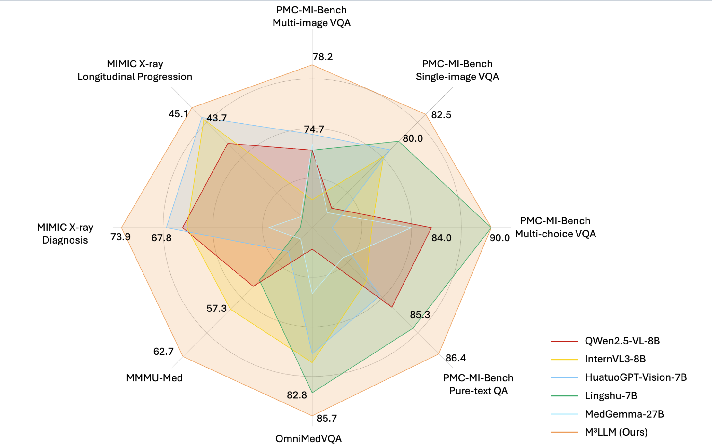
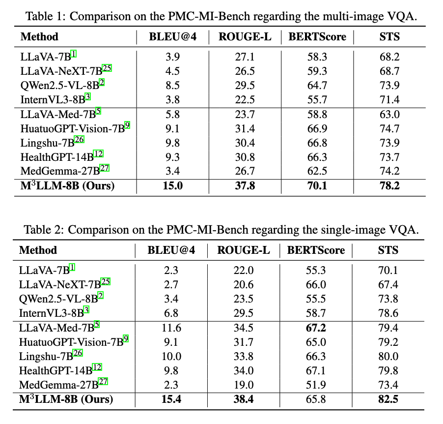
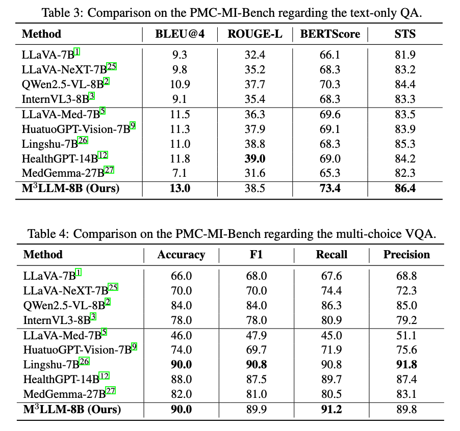
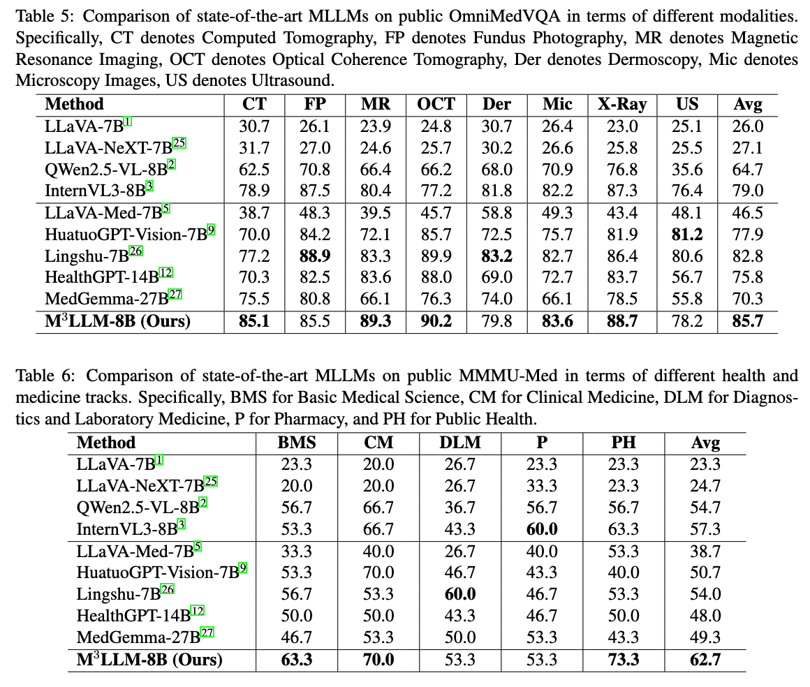
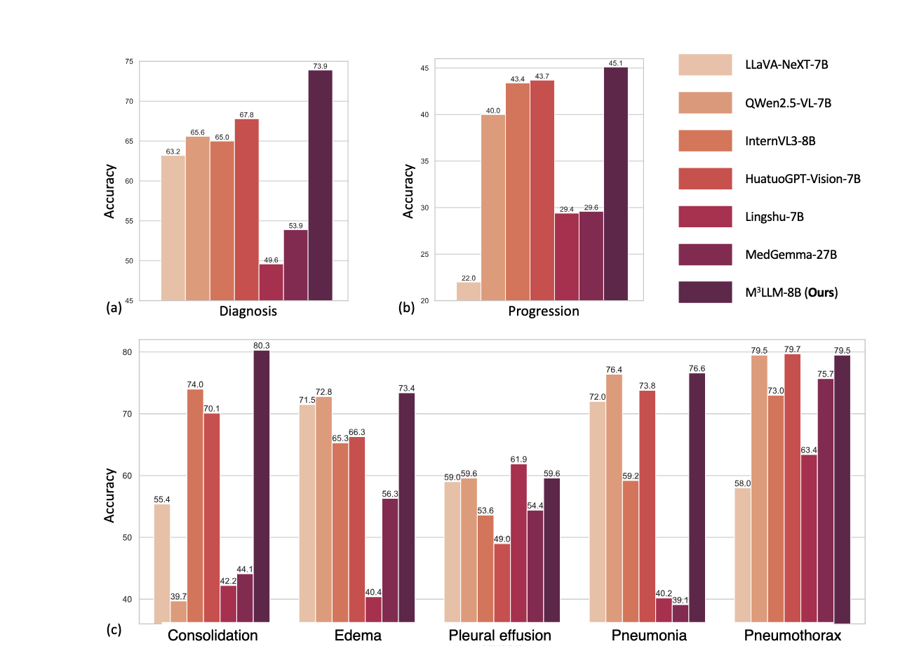

# M3LLM: Medical Multimodal Large Language Model

**M3LLM** is a specialized medical vision-language model built on [InternVL3-8B](https://huggingface.co/OpenGVLab/InternVL3-8B), finetuned on comprehensive PMC medical imaging datasets to achieve state-of-the-art performance on multi-image medical visual question answering tasks.


---

## 📊 Evaluation Results

### PMC-MI-Benchmark

Our model demonstrates strong performance on the PMC-MI-Benchmark, a comprehensive evaluation suite for multi-image medical visual question answering:

<!-- Insert PMC-MI-Benchmark results image here -->



### Public Benchmarks

M3LLM achieves competitive performance across various public medical VQA benchmarks (MMMU-Med and OmnimedVQA):

<!-- Insert public benchmark results image here -->



### MIMIC Evaluation

Performance evaluation on MIMIC-CXR :

<!-- Insert MIMIC results image here -->



---

## 🔄 Training Data Synthesis Pipeline

M3LLM's training data is generated through a comprehensive 5-stage synthetic data pipeline that processes medical images and captions from PubMed Central (PMC) literature.

### Pipeline Overview

```
Raw PMC Data → Stage 1-3: Preprocessing → Stage 4: Task-Specific QA → Stage 5: Context Refinement → Training Data
```

### Data Statistics

| Task Category | Samples | Description |
|--------------|---------|-------------|
| **Pure Text QA** | 40,382 | Text-only medical QA |
| **Bounding Box VQA** | 40,293 | Spatial relationship questions |
| **Single Sub-image** | 40,287 | Single sub-image reasoning |
| **Multiple Sub-images** | 39,462 | Multi-image reasoning |
| **Sub-image Options** | 40,295 | Multiple-choice questions |
| **Compound Images** | 37,029 | Compound figure understanding |
| **Total** | **~238K** | Six diverse task types |

### Pipeline Stages

**Stage 1-3: Data Preprocessing**
- `1_inline_text_summarization.py`: Summarizes medical observations from inline text
- `2_medical_knowledge_complementation.py`: Extracts keywords and generates medical knowledge
- `3_visual_perception_enhancement.py`: Creates visual perception descriptions using multimodal models

**Stage 4: Task-Specific QA Generation**
- Six specialized scripts for different medical VQA task types
- Generates questions, contexts, and answers based on medical images and captions
- Supports pure text, spatial reasoning, single/multi-image, and multiple-choice tasks

**Stage 5: Context Refinement**
- Improves question contexts to prevent data leakage
- Removes answer-revealing information while maintaining clinical reasoning requirements
- Ensures high-quality instruction-following data

📁 **Detailed pipeline documentation**: See [`Instruction_data_generation/`](Instruction_data_generation/) for implementation details and usage instructions.

---

## 🚀 Training

M3LLM provides two training approaches to accommodate different computational resources:

### Quick Start

```bash
# Navigate to training directory
cd InternVL

# LoRA training (recommended for limited resources)
bash internvl_chat/shell/internvl3.0/2nd_finetune/M3LLM-fulldata-lora.sh

# Full model training (better performance)
bash internvl_chat/shell/internvl3.0/2nd_finetune/M3LLM-fulldata-fullmodel.sh
```
📁 **Detailed training documentation**: See [`InternVL/`](InternVL/) for configuration details, hyperparameters, and troubleshooting.

---

## 📦 Installation

### Step 1: Clone the Repository

```bash
git clone https://github.com/franciszchen/M3LLM.git
cd M3LLM
```

### Step 2: Set Up Environment
We should have two conda environments.
#### For Evaluation

Please refer to the setup guidance in the [`benchmark/`](benchmark/) folder for evaluation-specific environment configuration.

#### For Training

Follow the installation instructions from the official [InternVL repository](https://github.com/OpenGVLab/InternVL):


### Step 3: Prepare Data

Please download our training data and benchmark data here:
[Data](https://yaleedu-my.sharepoint.com/:f:/g/personal/yihang_fu_yale_edu/IgD6PrryHADrRpbi3BVbsc1uAY9ZMWMzS6NmI3WBYLOEvlA?e=WZ6dOh)

### Step 4: Start Training

```bash
cd InternVL
# For LoRA training
bash internvl_chat/shell/internvl3.0/2nd_finetune/M3LLM-fulldata-lora.sh

# For full model training
bash internvl_chat/shell/internvl3.0/2nd_finetune/M3LLM-fulldata-fullmodel.sh
```

---

## 📂 Repository Structure

```
M3LLM/
├── Instruction_data_generation/     # Synthetic data generation pipeline
│   ├── 1_inline_text_summarization.py
│   ├── 2_medical_knowledge_complementation.py
│   ├── 3_visual_perception_enhancement.py
│   ├── 4_*.py                       # Stage 4: Task-specific QA generation
│   └── 5_*.py                       # Stage 5: Context refinement
│
├── InternVL/                        # Training codebase
│   ├── internvl_chat/
│   │   ├── shell/
│   │   │   ├── data/
│   │   │   │   └── PMC-data.json   # Dataset configuration
│   │   │   └── internvl3.0/
│   │   │       └── 2nd_finetune/   # Training scripts
│   │   ├── internvl/
│   │   │   ├── model/              # Model implementations
│   │   │   └── train/              # Training utilities
│   │   └── eval/                   # Evaluation scripts
│   └── README.md                   # Detailed training documentation
│
├── benchmark/                       # Evaluation benchmarks
│   └── MIMIC-unified-inference/    # MIMIC evaluation framework
│
└── README.md                        # This file
```

---

## 🎯 Model Checkpoints

We release the following model checkpoints:

| Model | Training Method | Download Link |
|-------|----------------|---------------|
| M3LLM-LoRA | LoRA (rank 16) | [Coming Soon] |
| M3LLM-Full | Full Finetuning | [Coming Soon] |

### Loading the Model

```python
from transformers import AutoModel, AutoTokenizer

# Load model
model = AutoModel.from_pretrained("path/to/m3llm-checkpoint")
tokenizer = AutoTokenizer.from_pretrained("path/to/m3llm-checkpoint")

# Example inference
# [Add inference example]
```

---

## 📖 Citation

If you find M3LLM useful for your research, please cite:

```bibtex
@article{chen2025compound,
  title={From Compound Figures to Composite Understanding: Developing a Multi-Modal LLM from Biomedical Literature with Medical Multiple-Image Benchmarking and Validation},
  author={Chen, Zhen and Fu, Yihang and Madera, Gabriel and Giuffre, Mauro and Applebaum, Serina and Kim, Hyunjae and Xu, Hua and Chen, Qingyu},
  journal={arXiv preprint arXiv:2511.22232},
  year={2025}
}
```

Please also cite the base model:

```bibtex
@article{internvl3,
  title={InternVL: Scaling up Vision Foundation Models and Aligning for Generic Visual-Linguistic Tasks},
  author={Chen, Zhe and others},
  journal={arXiv preprint},
  year={2024}
}
```

If you are using MIMIC-cxr dataset, please cite:
```bibtex
@inproceedings{mimic_xray,
  title={Learning to exploit temporal structure for biomedical vision-language processing},
  author={Bannur, Shruthi and Hyland, Stephanie and Liu, Qianchu and Perez-Garcia, Fernando and Ilse, Maximilian and Castro, Daniel C and Boecking, Benedikt and Sharma, Harshita and Bouzid, Kenza and Thieme, Anja and others},
  booktitle={CVPR},
  pages={15016--15027},
  year={2023}
}
```

---

## 🤝 Contributing

We welcome contributions! Please feel free to:
- 🐛 Report bugs
- 💡 Suggest new features
- 📝 Improve documentation
- 🔧 Submit pull requests

---

## 📄 License

This project is released under the [MIT License](LICENSE).

The InternVL codebase is subject to its original license terms. Please refer to the [InternVL repository](https://github.com/OpenGVLab/InternVL) for details.

---

